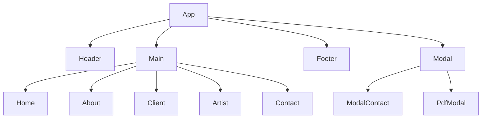
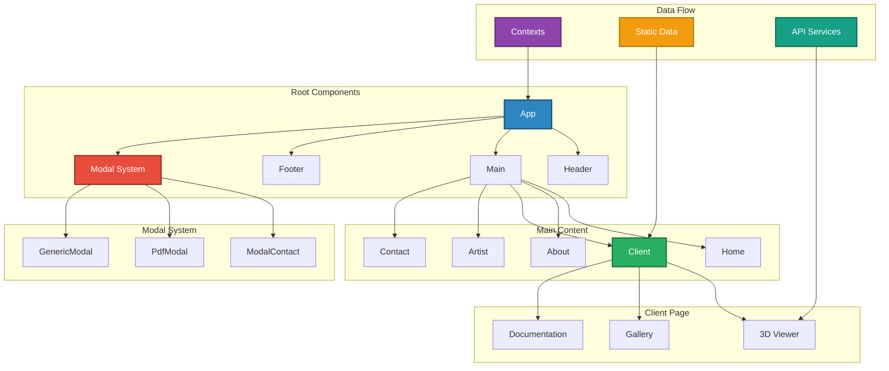
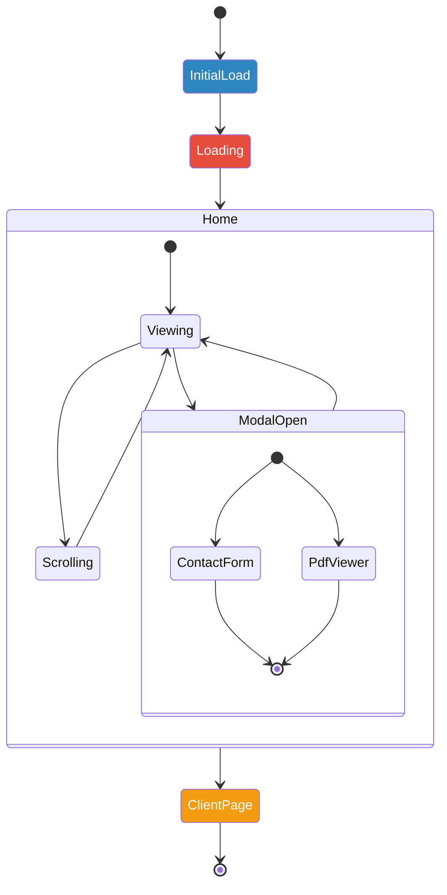
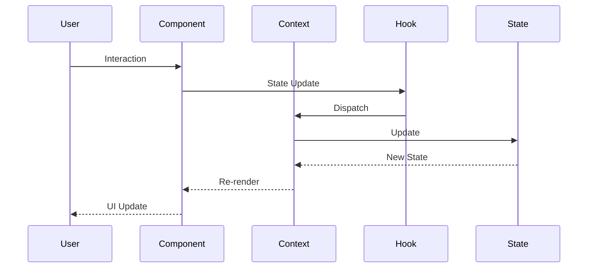
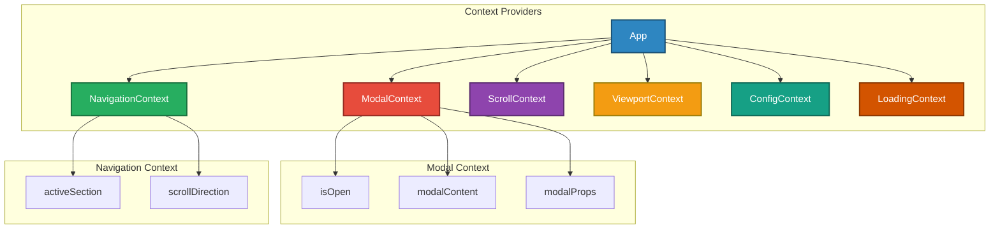
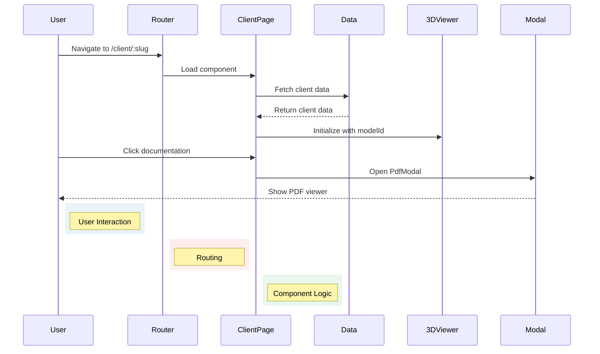
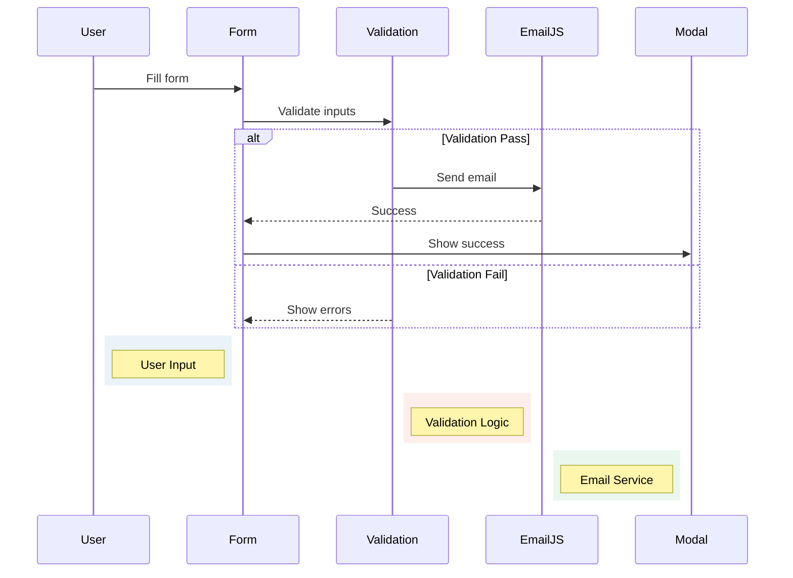
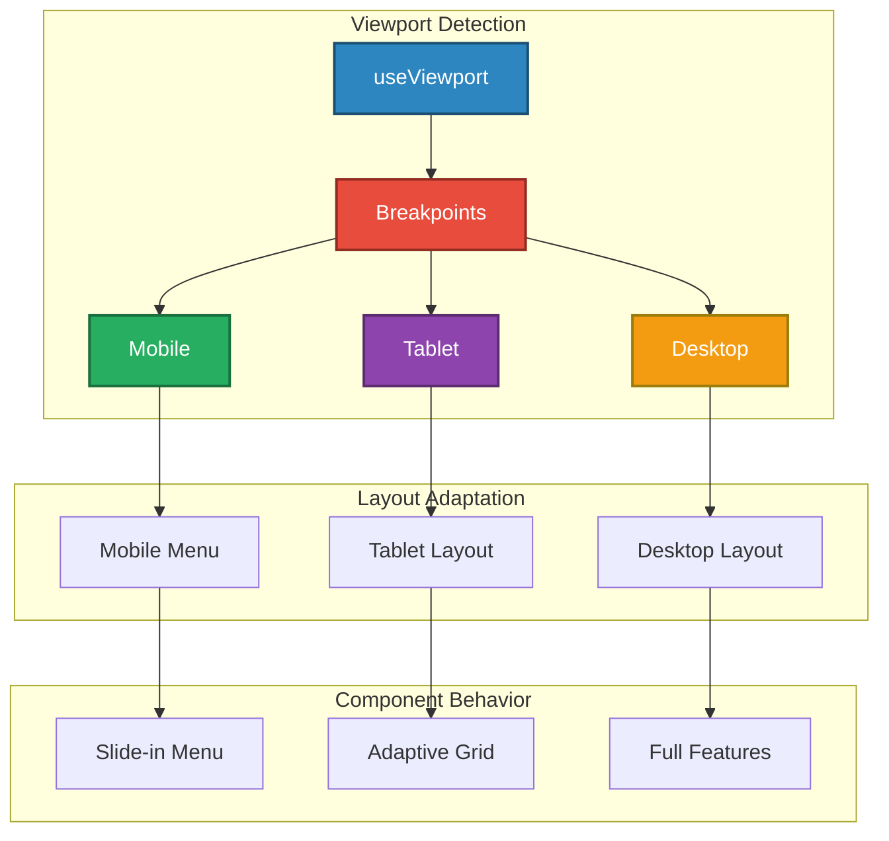
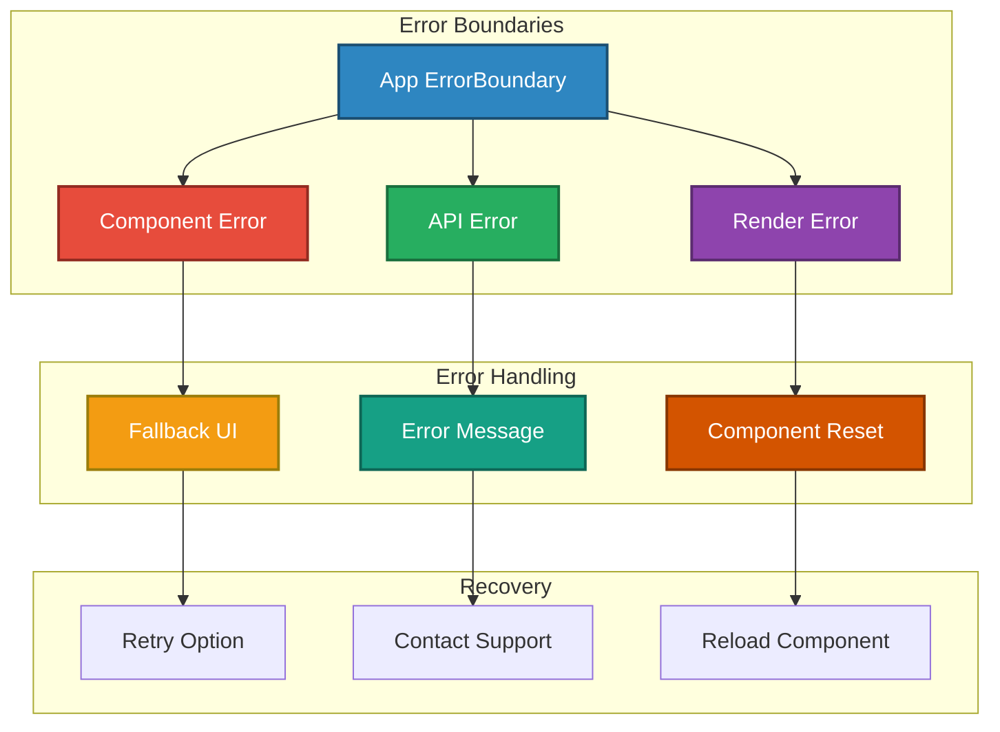

# Technical Documentation

A comprehensive breakdown of the structure, flow, logic, and architecture behind the Beringia Marine web application.

---

## 🗂️ Project Overview

- **Project Name**: Beringia Marine
- **Stack**: TypeScript, React, Vite, EmailJS
- **Key Features**:
  - Interactive 3D Sketchfab integration with custom controls
  - Dynamic client pages with rich media support
  - Contact form with EmailJS integration
  - Responsive design with mobile-first approach
  - PDF viewer for documentation
  - Featured artist showcase
  - SEO optimization with dynamic meta tags
- **Goals**:
  - Showcase marine technology solutions
  - Provide an engaging user experience
  - Ensure maintainable and scalable codebase
  - Optimize performance and accessibility

---

## 📁 Folder & File Structure

| Folder        | Purpose                 | Key Files                                   |
| ------------- | ----------------------- | ------------------------------------------- |
| `/src`        | Main application source | `main.tsx`, `index.css`                     |
| `/components` | React components        | `App.tsx`, `Header.tsx`, `Modal.tsx`        |
| `/contexts`   | State management        | `ModalContext.tsx`, `NavigationContext.tsx` |
| `/hooks`      | Custom React hooks      | `useScroll.tsx`, `useForm.tsx`              |
| `/data`       | Static content          | `types.ts`, `clients/`                      |
| `/utils`      | Helper functions        | `constants.ts`, `helpers.ts`                |
| `/assets`     | Static assets           | Images, icons, PDFs                         |
| `/types`      | TypeScript types        | Component props, API responses              |

---

## 🧱 Component Architecture

### Core Components



#### Explanation:

Think of this like a family tree for the website. At the top, we have the `App` component - it's like the parent that holds everything together. This parent has four main children:

1. **Header** - This is the website's navigation bar, always visible at the top
2. **Main** - This is where all the main content lives, and it has its own children:
   - Home page
   - About page
   - Client pages
   - Artist showcase
   - Contact page
3. **Footer** - The bottom section of the site
4. **Modal** - A pop-up system that can show:
   - Contact forms
   - PDF documents

_Technical Terms Explained:_

- **Component**: A reusable piece of code that controls a part of the user interface
- **Modal**: A pop-up window that appears on top of the main content
- **Hierarchy**: The parent-child relationship between different parts of the website

### **Complete Component Hierarchy with Data Flow**



#### Explanation:

This expanded diagram shows not just the family tree, but also how data flows through the website. Think of it like a city's infrastructure:

1. **Root Components** are like the main districts of the city:

   - The App is like City Hall
   - Header, Main, and Footer are like different neighborhoods
   - The Modal System is like the city's emergency services

2. **Main Content** is like the buildings in each neighborhood:

   - Each page (Home, About, Client, etc.) is a different building
   - They all follow the same architectural style (consistent design)

3. **Client Page** is like a special district with unique features:

   - 3D Viewer is like an interactive museum
   - Gallery is like an art exhibition
   - Documentation is like a library

4. **Data Flow** shows how information moves around:
   - Contexts are like the city's information network
   - Static Data is like the city's archives
   - API Services are like delivery services bringing in new information

_Technical Terms Explained:_

- **Subgraph**: A group of related components
- **Data Flow**: How information moves through the application
- **API Services**: External services that provide data or functionality
- **Contexts**: Global state management system

### **State Management Flow**



#### Explanation:

This diagram shows how the website moves through different "states" or conditions, like a story with different chapters:

1. **Starting Up** (Blue):

   - The website begins loading (InitialLoad)
   - Shows a loading screen
   - Finally lands on the Home page

2. **On the Home Page** (Green):

   - Users can be viewing content
   - They might start scrolling
   - They might open a modal (pop-up)
   - They can move to a Client page

3. **When a Modal Opens** (Purple):

   - It could be a contact form
   - Or a PDF viewer
   - When they're done, they return to where they were

4. **Client Page** (Orange):
   - A special state for viewing client-specific content
   - Can return to the home page when done

_Technical Terms Explained:_

- **State**: The current condition or mode of the application
- **State Diagram**: A visual representation of how the application moves between different conditions
- **Modal**: A temporary window that appears on top of the main content
- **InitialLoad**: The first state when the application starts

### State Updates Flow



#### Explanation:

This diagram shows what happens behind the scenes when a user interacts with the website, like following a package through a delivery system:

1. **User Interaction** (Starting Point):

   - User clicks a button or performs an action
   - Like dropping a package at the post office

2. **Component Processing** (First Stop):

   - The component receives the interaction
   - Like the post office sorting the package

3. **Hook Handling** (Processing Center):

   - Custom hooks process the interaction
   - Like a distribution center processing the package

4. **Context Update** (Central Hub):

   - The context system updates the global state
   - Like updating the package tracking system

5. **State Change** (Final Processing):

   - The state updates and triggers a re-render
   - Like the package reaching its final destination

6. **UI Update** (Delivery):
   - The user sees the changes on screen
   - Like the recipient receiving the package

_Technical Terms Explained:_

- **Sequence Diagram**: Shows step-by-step interactions
- **Hook**: A reusable piece of logic
- **Context**: Global state management system
- **Re-render**: Updating what the user sees
- **Dispatch**: Sending an update through the system

### **Context Provider Hierarchy**



#### Explanation:

Think of this as a control center for the website, with specialized departments managing different aspects:

1. **Main Control Room** (Blue):

   - App serves as the central command center
   - Oversees all specialized departments

2. **Specialized Departments** (Different Colors):

   - **Modal Department** (Red): Manages pop-up windows

     - Tracks modal open/close state
     - Controls modal content
     - Handles modal settings

   - **Navigation Department** (Green): Manages user location

     - Tracks current section
     - Monitors scroll direction

   - **Scroll Department** (Purple): Handles scrolling
   - **Viewport Department** (Orange): Manages screen sizes
   - **Config Department** (Teal): Stores settings
   - **Loading Department** (Dark Orange): Handles loading states

_Technical Terms Explained:_

- **Context Provider**: System for sharing state across components
- **State Variables**: Changeable information affecting the UI
- **Subgraph**: Group of related functionality
- **Global State**: Application-wide accessible information

### **Data Flow for Client Pages**



#### Explanation:

This diagram shows the client page visit process:

1. **Starting Point** (Blue):

   - User clicks client link
   - Router determines destination

2. **Navigation** (Red):

   - Router loads correct component
   - Page fetches client data

3. **Content Display** (Green):
   - Page loads client information
   - 3D viewer initializes
   - Documentation available via PDF viewer

_Technical Terms Explained:_

- **Router**: Navigation system between pages
- **Component**: Reusable UI element
- **3D Viewer**: Interactive model display
- **Modal**: Pop-up content window

### **Contact Form Flow**



#### Explanation:

This diagram shows the contact form submission process:

1. **Form Entry** (Blue):

   - User completes form fields
   - System validates input

2. **Validation** (Red):

   - Checks form completeness
   - Returns errors if invalid
   - Proceeds if valid

3. **Submission** (Green):
   - Sends email via EmailJS
   - Shows success confirmation
   - Displays error if failed

_Technical Terms Explained:_

- **Validation**: Input verification process
- **EmailJS**: Email sending service
- **Modal**: Message display window
- **Alt/Else**: Conditional paths

### **Responsive Design Flow**



#### Explanation:

This diagram shows the website's screen size adaptation:

1. **Detection** (Blue):

   - System checks screen dimensions
   - Determines device category

2. **Layout Selection** (Different Colors):

   - **Mobile** (Green): Slide-in menu
   - **Tablet** (Purple): Adaptive grid
   - **Desktop** (Orange): Full features

3. **Implementation**:
   - Components adjust behavior
   - Layouts optimize for size
   - Features scale appropriately

_Technical Terms Explained:_

- **Viewport**: Screen display area
- **Breakpoints**: Layout change thresholds
- **Adaptive Grid**: Flexible layout system
- **Component Behavior**: Size-specific actions

### **Error Handling Flow**



#### Explanation:

This diagram shows the website's error management system:

1. **Detection** (Blue):

   - Error boundary catches issues
   - System identifies error type

2. **Error Types** (Different Colors):

   - **Component Errors** (Red): Fallback UI
   - **API Errors** (Green): Error messages
   - **Render Errors** (Purple): Component reset

3. **Recovery**:
   - Retry options available
   - Support contact provided
   - Component reload possible

_Technical Terms Explained:_

- **Error Boundary**: Error containment system
- **Fallback UI**: Alternative interface
- **Component Reset**: Component restart
- **Recovery**: Error resolution process

These diagrams provide a comprehensive view of:

1. Component hierarchy and relationships
2. State management and data flow
3. Context provider structure
4. Client page data flow
5. Contact form submission process
6. Responsive design implementation
7. Error handling strategy

### Key Component Responsibilities

- **App.tsx**:
  - Application root
  - Context providers
  - Routing setup
  - Error boundary implementation
- **Header.tsx**:
  - Navigation logic
  - Scroll behavior
  - Mobile menu
  - Theme switching
- **Client.tsx**:
  - Dynamic content rendering
  - Media gallery
  - 3D model integration
  - Documentation viewer
- **Modal.tsx**:
  - Modal management
  - Animation handling
  - Focus management
  - Escape key handling

---

## 🪝 Hooks & Contexts

### Custom Hooks

| Hook                 | Description                          | Usage              |
| -------------------- | ------------------------------------ | ------------------ |
| `useScroll`          | Tracks scroll position and direction | Header, navigation |
| `useViewport`        | Manages viewport dimensions          | Responsive layouts |
| `useForm`            | Form state and validation            | Contact form       |
| `useModal`           | Modal state management               | All modals         |
| `useSketchfabApi`    | 3D model integration                 | Client pages       |
| `useTransition`      | Animation management                 | Page transitions   |
| `useMediaQuery`      | Responsive design                    | Layout adjustments |
| `useApiErrorHandler` | Error handling                       | API calls          |

### Context Providers

| Context             | Purpose                | Usage                   |
| ------------------- | ---------------------- | ----------------------- |
| `ModalContext`      | Modal state management | Global modal access     |
| `NavigationContext` | Navigation state       | Active section tracking |
| `ScrollContext`     | Scroll position        | Animations, tracking    |
| `ViewportContext`   | Viewport dimensions    | Responsive design       |
| `ConfigContext`     | App configuration      | Environment variables   |
| `LoadingContext`    | Loading states         | Loading indicators      |

---

## 🔁 Data Flow & Integration

### Data Structure

```tsx
interface ClientData {
  id: string;
  name: string;
  slug: string;
  seo: {
    title: string;
    description: string;
    ogImage: string;
  };
  // ... other fields
}
```

### Integration Points

1. **Sketchfab API**
   - 3D model embedding
   - Custom controls
   - Loading states
   - Error handling
2. **EmailJS**
   - Contact form submission
   - Email templates
   - Success/failure handling
3. **Static Content**
   - TypeScript-based content management
   - Dynamic routing
   - SEO optimization

---

## 🧪 UX Implementation

### Loading Experience

- Custom loading component
- Progressive content loading
- Smooth transitions

### Navigation

- Smooth scroll behavior
- Mobile-friendly menu
- Active section tracking
- Anchor link support

### Modals

- Centralized management
- Keyboard navigation
- Focus trapping
- Animation system

### Responsive Design

- Mobile-first approach
- Viewport-based layouts
- Dynamic content adaptation
- Performance optimization

---

## 🌐 SEO & Performance

### Meta Management

- Dynamic meta tags
- OpenGraph integration
- Twitter cards
- Canonical URLs

### Performance Optimization

- Code splitting
- Lazy loading
- Image optimization
- Asset caching

---

## 🚧 Future Improvements

1. **Technical Enhancements**
   - Add TypeScript strict mode
   - Implement unit testing
   - Add E2E testing
   - Performance monitoring
2. **Feature Additions**
   - CMS integration
   - Blog section
   - User authentication
   - Analytics dashboard
3. **Architecture**
   - State management optimization
   - API layer abstraction
   - Error tracking system
   - Performance monitoring

Would you like me to dive deeper into any specific section or provide more detailed information about particular aspects of the implementation?
