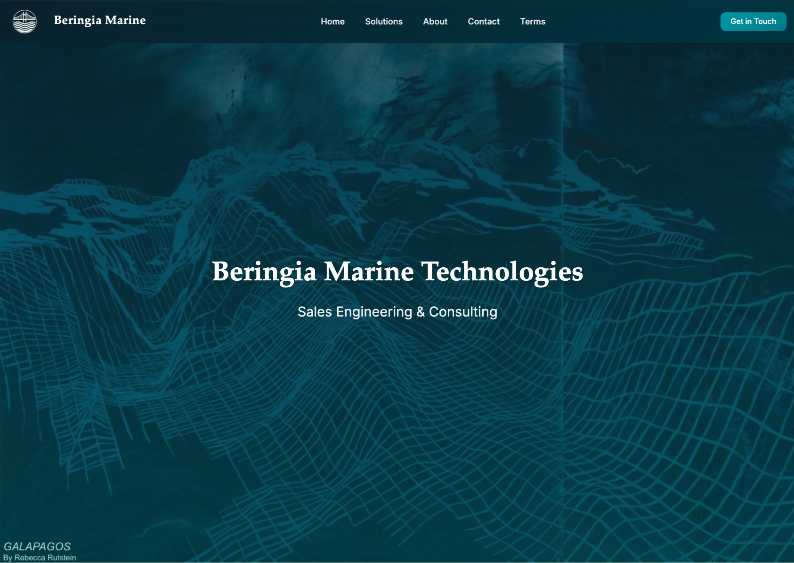
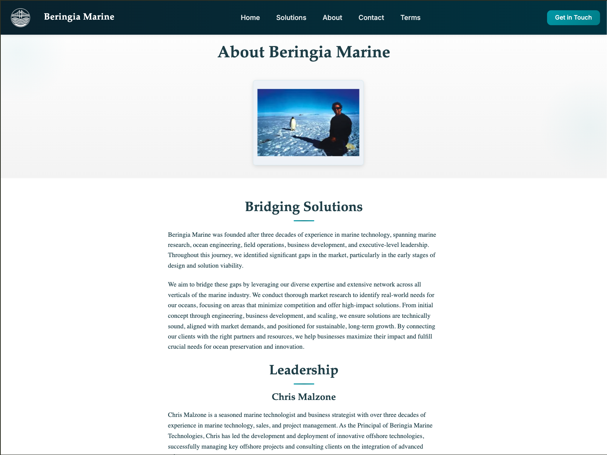
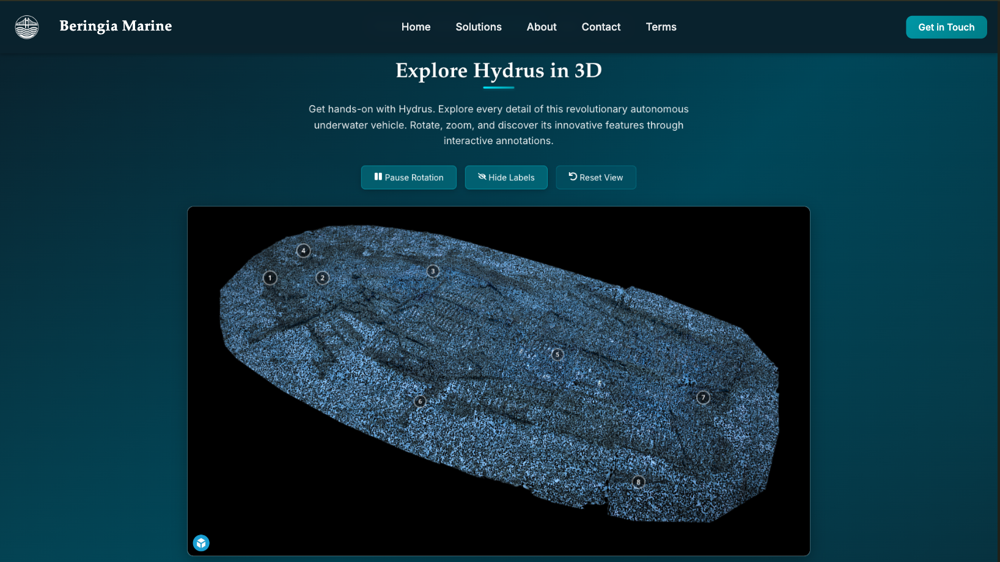
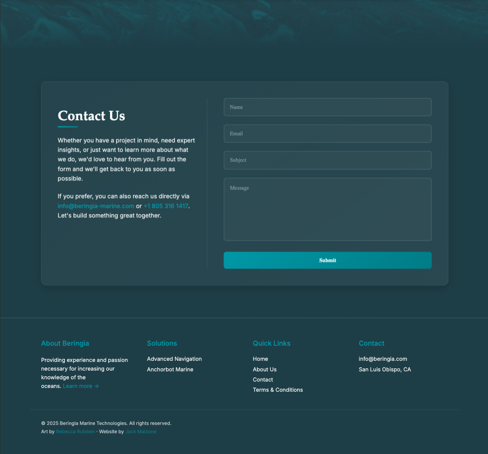
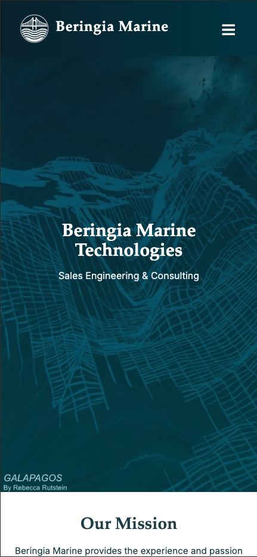
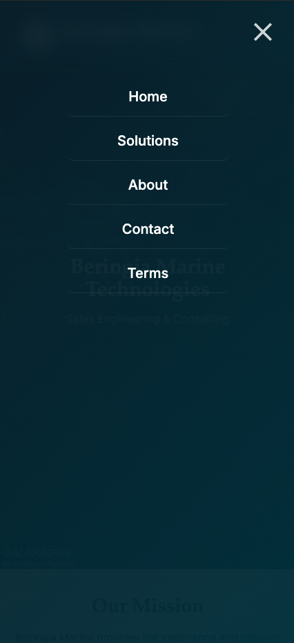
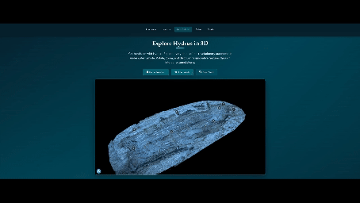

# Beringia Marine Website

## About

Beringia Marine is a modern web application showcasing marine technology and underwater exploration services. The platform features an interactive 3D model of a shipwreck (captured by hydrus), comprehensive service information, and a seamless contact system for potential clients.

## Features

- Interactive 3D model viewer with Sketchfab integration
- Responsive design optimized for all devices
- Type-safe implementation with comprehensive error handling
- Glass-morphism UI elements for modern aesthetics
- Contact form with real-time validation
- Modal-based user interface for enhanced UX
- Dark marine theme with dynamic gradients
- Smooth animations and transitions

## Demo & Screenshots

### Desktop View






### Mobile View




### 3D Model Interaction



### Documentation Assets

The screenshots and demo GIFs are stored in the `docs/assets` directory. To maintain the documentation:

1. Use descriptive filenames (e.g., `desktop-home.png`, `mobile-nav.png`)
2. Optimize images before committing:
   - Screenshots: PNG format, max width 1920px
   - GIFs: Compressed, max width 1200px
3. Include both light and dark theme versions if applicable
4. Update screenshots when major UI changes occur

Recommended screenshot dimensions:

- Desktop: 1920x1080 or 1440x900
- Mobile: 390x844 (iPhone 14 size)
- Tablet: 1024x768

## Technologies & Tools

### Frontend

- React 18 with TypeScript
- CSS3 with BEM methodology
- Sketchfab API integration
- Custom React Hooks
- Error Boundary implementation
- Context API for state management

### Development Tools

- ESLint & Prettier
- Git & GitHub
- Chrome DevTools
- TypeScript compiler
- Vite for development and building

## Live Demo

Visit the live website: [Beringia Marine](https://jackmalzone.github.io/se_project_beringia/)

## Getting Started

1. Clone this repository

   ```bash
   git clone https://github.com/jackmalzone/se_project_beringia.git
   ```

2. Install dependencies

   ```bash
   npm install
   ```

3. Create a .env file in the root directory

   ```env
   VITE_SKETCHFAB_API_KEY=your_api_key
   ```

4. Start the development server
   ```bash
   npm run dev
   ```

## Available Scripts

- `npm run dev`: Start development server
- `npm run build`: Build production version
- `npm run preview`: Preview production build
- `npm run deploy`: Deploy to GitHub Pages
- `npm run lint`: Run ESLint
- `npm run lint:fix`: Fix ESLint issues
- `npm test`: Run tests

## Project Structure

```
src/
├── api/                    # API clients and interfaces
│   └── sketchfab-client.ts
├── assets/                 # Static assets (images, fonts, etc.)
├── components/            # React components
│   ├── About/             # About section components
│   ├── App/               # Root app component
│   ├── Client/            # Client page components
│   ├── Contact/           # Contact form components
│   ├── Contributions/     # Contributions section
│   ├── ExpertiseSection/  # Expertise showcase
│   ├── Footer/           # Footer component
│   ├── Header/           # Navigation header
│   ├── HeroBanner/       # Hero section components
│   ├── Home/             # Home page components
│   ├── Main/             # Main layout wrapper
│   ├── Modal/            # Modal system components
│   ├── ModalContact/     # Contact form modal
│   ├── SeascapeDivider/  # Decorative divider
│   ├── shared/           # Shared/reusable components
│   ├── Sketchfab/        # 3D viewer components
│   └── Terms/            # Terms and conditions
├── contexts/             # React contexts
│   └── ModalContext/     # Modal management context
├── data/                 # Static data and constants
├── hooks/               # Custom React hooks
│   ├── useActiveSection.ts
│   ├── useApiErrorHandler.ts
│   ├── useForm.ts
│   ├── useLoading.ts
│   ├── useMediaQuery.ts
│   ├── useModal.ts
│   ├── useNavigation.ts
│   ├── useScroll.tsx
│   ├── useScrollContext.ts
│   ├── useScrollToSection.ts
│   ├── useSketchfabApi.ts
│   ├── useTransition.ts
│   └── useViewport.ts
├── types/               # TypeScript type definitions
├── utils/              # Utility functions
└── vendor/             # Third-party code
```

## Component Architecture

### Error Handling

- ErrorBoundary component for catching React errors
- HOC pattern for component-level error handling
- Custom hook for API error management
- Type-safe error interfaces

### Form Management

- Custom useForm hook with validation
- Real-time field validation
- Type-safe form handling
- Comprehensive error feedback

### Modal System

- Context-based modal management
- Reusable modal components
- Animated transitions
- Responsive design

### 3D Model Integration

- Sketchfab API wrapper
- Custom controls and UI
- Loading states and error handling
- Responsive iframe implementation

## Future Improvements

1. Enhanced 3D Interaction

   - Custom camera controls
   - Multiple model support
   - Annotation system
   - Model measurements

2. Performance Optimization

   - Lazy loading implementation
   - Image optimization
   - Code splitting
   - Performance monitoring

3. Additional Features

   - Project portfolio gallery
   - Blog/News section
   - Team member profiles
   - Case studies

4. Enhanced Contact System

   - Email integration
   - Form submission tracking
   - Auto-response system
   - Contact history

5. Analytics Integration
   - User behavior tracking
   - Performance metrics
   - Conversion tracking
   - A/B testing

## Contributing

1. Fork the repository
2. Create your feature branch (`git checkout -b feature/AmazingFeature`)
3. Commit your changes (`git commit -m 'Add some AmazingFeature'`)
4. Push to the branch (`git push origin feature/AmazingFeature`)
5. Open a Pull Request

## Security

- Environment variables for sensitive data
- Type safety throughout the application
- Input validation and sanitization
- Error handling for all API calls

## Browser Support

- Chrome (latest)
- Firefox (latest)
- Safari (latest)
- Edge (latest)
- Mobile browsers

## License

This project is licensed under the MIT License - see the [LICENSE](LICENSE) file for details.

## Authors

- **Jack Malzone** - _Initial work_ - [LinkedIn](https://www.linkedin.com/in/jack-malzone/)

## Acknowledgments

- Sketchfab for 3D model integration
- React team for the framework
- My dad for the opportunity to have creative control over the project
- Open source community for inspiration and tools
